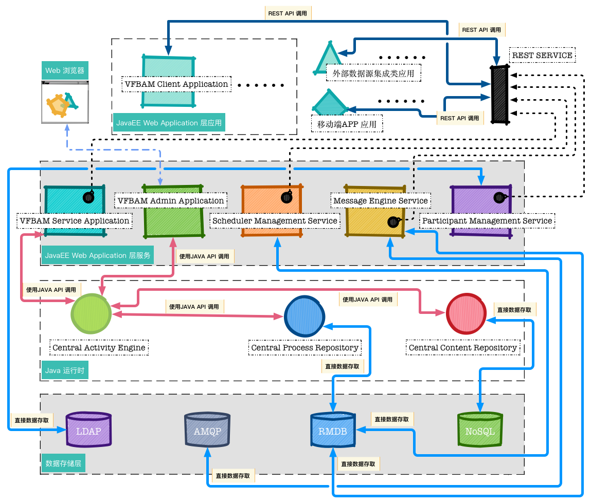
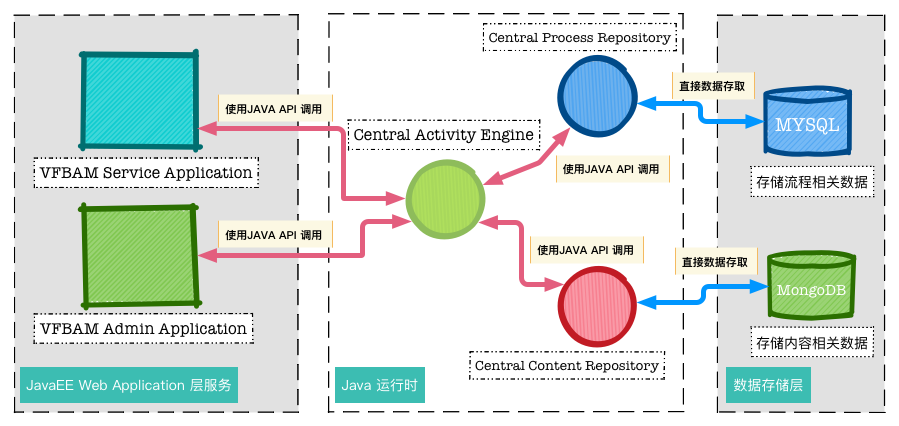
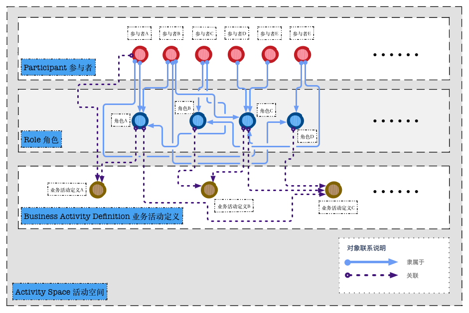
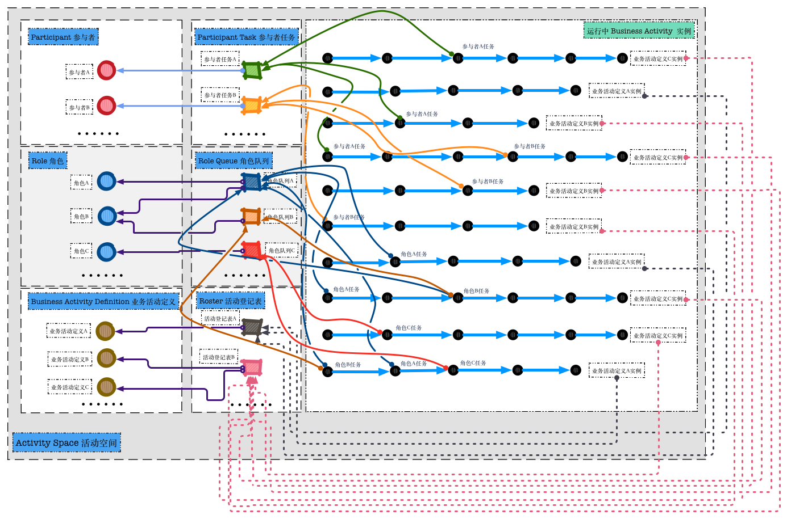

# ViewFUNCTION 智慧协作管理平台系统架构概述

## ❏ 什么是 ViewFUNCTION 智慧协作管理平台

随着企业的发展，会产生各种类型的工作流程，这些流程会交织在日常业务之中以确定业务运营的步调；而伴随着企业业务的增长，又会给企业带来海量的电子内容资产，这些电子内容资产互相交织在一起并与企业的流程息息相关。为了满足企业的多种业务需求，需要有一个统一的平台来管理内容和流程；通过自动化、简化和优化流程与内容之间的关系，来提高流程绩效、缩短循环周期时间，提升企业生产力。  

ViewFUNCTION 智慧协作管理平台是新一代的、集成式企业`工作流程处理`、`业务内容管理`以及`团队协作应用`系统。它结合了企业内容管理架构以及全面的业务流程管理框架，能够满足企业的各种复杂内容和流程管理需求。通过使用 ViewFUNCTION 智慧协作管理平台，可以方便快捷的构建功能强大的企业业务活动管理应用。同时通过独特地耦合流程、内容，以及与现有 IT 环境进行集成，ViewFUNCTION 智慧协作管理平台可以高效地为那些每天需要制订关键业务决策的人员提供内容支持。

## ❏ 系统架构概述

ViewFUNCTION 智慧协作管理平台主要使用 `Java EE` 技术开发服务层， `JavaScript` 技术开发各类 Web 端应用。前后端统一使用 `REST Web Service` 进行数据通讯。 
 
为实现系统中各种复杂的业务功能，平台内部按照不同的业务功能分为若干独立的业务服务层子功能组件，每个组件提供专门满足某一特定领域的子业务需求所需的全部功能特性。平台的整体业务功通过组合使用各个子功能组件的功能特性而实现。各个业务服务层子功能组件之间相互独立，所有子功能组件都可以独立运行，为各类外部调用应用系统提供相关领域的全部功能特性。

下图为 ViewFUNCTION 智慧协作管理平台架构框图：

#### ➜ 平台数据存储层结构

根据不同的业务需求以及功能扩展的需要，在 ViewFUNCTION 智慧协作管理平台中使用了多种不同的数据存贮技术和产品来保存业务数据和支撑业务功能需求。以下是这些技术和相应产品的简要说明：

◼︎ **RMDB - MySQL**（ [www.mysql.com](http://www.mysql.com) ）系统中使用关系数据库`MySQL`存储流程系统中的流程节点状态数据，消息系统中的持久化邮件数据和日程调度系统中的定时任务记录数据。

◼︎ **NoSQL - MongoDB**（ [www.mongodb.com](https://www.mongodb.com) ）系统中使用 NoSQL 数据库`MongoDB`存储流程系统中的结构化流程数据，附着在流程上的非结构化文件内容，以及其他的所有和内容关系系统相关的数据。

◼︎ **LDAP - ApacheDS**（ [directory.apache.org](http://directory.apache.org) ）系统中使用 LDAP 服务器 ApacheDS存储所有的活动空间中的人员基本信息和登录信息以及执行安全策略管理。

◼︎ **AMQP - Apache Qpid**（ [qpid.apache.org](http://qpid.apache.org) ）系统使用 AMQP 消息队列服务器 Apache Qpid 来存储中转存储所有执行异步通讯的临时数据和信息。

#### ➜ 平台业务服务层子功能组件

平台内部按照不同的业务功能分为多个业务服务层子功能组件，每个子功能组件都是以一个 `Jave EE` `Web Application`的形式统一的运行在同一个`Web Application Container`中。在 ViewFUNCTION 智慧协作管理平台的默认安装中使用 **Apache Tomcat**（[tomcat.apache.org](http://tomcat.apache.org) ）做为 Web Application Server（Container）。每一个子功能组件都以一个独立的  Application 的形式部署在 Tomcat 中。以下是各个业务服务层子功能组件的简要说明：

◼︎ **VFBAM Service Application** 通过直接在 Java 运行时环境中调用核心中央活动引擎 API 的方式提供了对`业务活动空间`进行业务操作的功能。VFBAM Service Application 提供了一套包含了所有针对`业务活动空间`进行操作功能的 `REST API` 供外部应用系统调用。通过调用这套 REST API， 可以实现例如 *启动业务流程实例*；*查询、分配、完成流程节点任务*，*为流程添加文件* 等各种业务功能。

◼︎ **VFBAM Admin Application** 通过直接在 Java 运行时环境中调用核心中央活动引擎 API 的方式提供了对`业务活动空间`进行管理的功能。VFBAM Admin Application 提供了一个 Web Application 应用，通过在 Web 浏览器中使用该应用。用户可以完成针对特定`业务活动空间`的所有管理工作（例如*部署、更新业务流程定义*；*管理参与者，角色，角色队列*；*实时处理运行中流程实例* 以及 *实时对流程运行进行内容管理* 等）。

◼︎ **VFBAM Client Application** ViewFUNCTION 系统的所有功能都以 `REST API` 的形式提供给外界应用系统使用。通过组合使用各类 REST Service，可以开发出使用 ViewFUNCTION 平台做为后端的各类应用。VFBAM Client Application 是 ViewFUNCTION 平台客户端应用的官方参考实现。它是一个使用 `Javascript` 技术编写的纯 WEB 客户端应用。它组合使用了平台提供的全部 REST Service，为平台的所有功能提供了操作界面。

◼︎ **Message Engine Service** 提供平台系统中所有和消息通讯相关的业务功能。Message Engine Service 使用 Apache Qpid 消息队列技术提供了一个泛用的异步数据交换机制，能够通过系统配置来动态添加消息主题供外部系统调用。针对 ViewFUNCTION 系统的信息和通知功能，Message Engine Service 提供了专门的实现机制，使用 MySQL 将消息队列中的异步临时存储和中转数据内容，持久化存储为ViewFUNCTION 系统的信息和通知，并提供 `REST API`供其他业务服务层功能组件使用。Message Engine Service 本身是一个可以脱离 ViewFUNCTION 体系独立运行的产品。其功能的实现不依赖于 ViewFUNCTION 系统的其他业务服务层功能组件。

◼︎ **Participant Management Service** 提供平台系统中所有和用户身份信息管理和登陆认证相关的业务功能。所有功能的操作都以`REST API` 的形式提供给外界应用系统使用。Participant Management Service 使用 `LDAP` 规范存储和管理用户身份信息。并通过使用 LDAP 服务器自身的用户身份验证机制和安全策略来执行ViewFUNCTION 平台的用户登录管理。默认安装下Participant Management Service 使用 `ApacheDS` 作为后端的 LDAP服务器。通过使用配置文件中的 LDAP 属性映射，Participant Management Service 也可以透明切换使用任何其他的 LDAP 服务器作为用户身份管理的后端数据源。Participant Management Service 本身是一个可以脱离 ViewFUNCTION 体系独立运行的产品。其功能的实现不依赖于 ViewFUNCTION 系统的其他业务服务层功能组件。

◼︎ **Scheduler Management Service** ViewFUNCTION 平台的很多功能依赖于定时任务调度和日程提示。Scheduler Management Service 使用 **Quartz** （[www.quartz-scheduler.org](http://www.quartz-scheduler.org) ）技术构建了定时任务调度系统供其他服务层功能组件调用，定时任务调度数据使用 MySQL持久化存储。在目前的 ViewFUNCTION 平台功能范围内，只有当业务活动定义中使用了任务截止日期提醒功能时才需使用 Scheduler Management Service。

# ViewFUNCTION 智慧协作管理平台中央活动引擎概述

## ❏ 什么是 中央活动引擎（Central Activity Engine） 

ViewFUNCTION 智慧协作管理平台是新一代的、集成式企业工作流程处理、业务内容管理以及团队协作应用系统。它结合了企业内容管理架构以及全面的业务流程管理框架，能够满足企业的各种复杂内容和流程管理需求。为实现这些功能，ViewFUNCTION 系统平台使用了若干基于 Java 技术的核心功能组件，中央活动引擎（Central Activity Engine）是其中最重要的，它通过提供 `Java API` 的方式实现了所有 ViewFUNCTION 系统平台中与业务流程管理以及企业内容管理相关的功能支持。

下图为中央活动引擎在 ViewFUNCTION 平台中与其他组件的系统交互图： 
 

在 ViewFUNCTION 平台中中央活动引擎（Central Activity Engine）是以 Java 类库的形式存在的。平台中的 `VFBAM Service Application` 和 `VFBAM Admin Application` 通过使用 JAVA API 调用的方式使用中央活动引擎来处理流程和内容相关的数据。中央活动引擎本身也是通过 JAVA API 调用的方式使用 `Central Process Repository` 处理 流程相关操作，使用 `Central Content Repository` 处理内容相关的操作。

## ❏ 中央活动引擎（Central Activity Engine）逻辑模型概述

为了对业务活动中的流程信息和内容信息提供透明无缝的集成操作，中央活动引擎设计了专门的领域逻辑模型。通过使用 Java API 对这些领域逻辑模型进行操作，可以编程实现 ViewFUNCTION 平台中的所有相关功能。在中央活动引擎的业务领域逻辑模型中最基础的模型对象是 `Activity Space（活动空间）`，所有的其他模型对象都运行在 Activity Space 中。Activity Space 对应了一个使用 ViewFUNCTION 平台的最小单元的业务组织。根据在平台系统中运行时的具体作用，其他的领域逻辑模型可分为`业务活动定义相关领域逻辑模型`和`业务活动运行相关领域逻辑模型`两类。

#### ➜ 业务活动定义相关领域逻辑模型

中央活动引擎中与业务活动定义相关的模型对象共有以下三类。它们共同定义了在一个 Activity Space 中包含的业务活动的具体运行细节：

◼︎ **Participant（参与者）** 参与者代表了一个活动空间（业务组织）中所有参与业务运行的真实人员。每一个参与者都拥有一个全局唯一的ID。参与者是执行业务活动定义中的节点任务的真正主体。在实践中可以认为角色类似于一个企业组织中的一个业务人员。

◼︎ **Role（角色）** 角色代表了一个活动空间（业务组织）中按照特定的业务规则划分而具有共同特性的一组参与者。通常情况下角色是用来与业务活动定义中的节点任务进行关联的逻辑模型。在实践中可以认为角色类似于一个企业组织中的一个部门。

◼︎ **Business Activity Definition（业务活动定义）** 业务活动定义通过使用工作流引擎的流程定义技术来表示具体的流程运行的节点任务跳转逻辑以及在整个流程中和各个流程节点中可以使用的数据项目的定义。

下图为业务活动定义相关领域逻辑模型之间的相互关系：

在一个特定的 Activity Space 中可以包含有任意数量的`Participant（参与者）`,`Role（角色）`以及`Business Activity Definition（业务活动定义）`。一个**Participant（参与者）**可以隶属于任意数量的**Role（角色）**。每一个**Role（角色）**都可以关联到任意**Business Activity Definition（业务活动定义）**中的任意任务节点上。同时根据特定的业务需求也可以将**Participant（参与者）**与任意**Business Activity Definition（业务活动定义）**中的任意任务节点进行关联。

为了在实践中使用 ViewFUNCTION 平台，必须首先按照以下步骤定义好所需的`业务活动定义相关领域逻辑模型`

1. 创建 ***Activity Space（活动空间）***。
2. 在 ***Activity Space（活动空间）***中根据业务组织中的行政或业务规则创建所需的 ***Role（角色）***。一般情况下角色与一个业务组织中的业务部门一一对应。
3. 在 ***Activity Space（活动空间）***中根据业务组织中的人员信息创建所需的 ***Participant（参与者）***。一般情况下一个参与者与业务组织中的一个自然人相对应。
4. 根据企业的行政或业务规则将所有的***Participant（参与者）***添加到他所属的 ***Role（角色）***中。一个参与者可以隶属于任意数量的角色。
5. 根据业务需求设计并部署具体的***Business Activity Definition（业务活动定义）***。在业务活动定义中各个流程任务节点相关的人员或部门必须与活动空间中已经定义过的角色相对应（`关联`角色与流程任务节点）

#### ➜ 业务活动运行相关领域逻辑模型

当业务活动定义相关领域逻辑模型数据在活动空间中定义完毕后就可以创建已经部署了的业务活动定义的运行时实例。在运行中活动空间中会同事存在数量众多的各种不同业务活动定义的运行时实例。每个业务活动实例上还包含若干与角色或参与者相关的业务活动节点任务。为了按照业务需求获取这些数据，需要使用业务活动运行相关领域逻辑模型。

中央活动引擎中负责在平台运行时处理具体业务操作的模型对象共有以下三类。它们共同定义了如何在一个 Activity Space 中获取特定业务活动实例或业务活动流程任务节点的操作方式。

◼︎ **Participant Task（参与者任务）** 每一个参与者都与一个特定的参与者任务模型对象相对应，通过使用参与者任务模型对象可以获取到一个特定的参与者在活动空间中所有正在处理中的业务活动节点任务。

◼︎ **Role Queue（角色队列）** 角色队列与若干个特定的角色相互关联，通过使用角色队列模型对象可以获取到与它相关联的所有角色在活动空间中所有等待处理的业务活动节点任务。

◼︎ **Roster（活动登记表）** 活动登记表与若干个特定的业务活动定义相互关联。通过使用活动登记表模型对象可以获取到与它相关联的所有业务活动定义在活动空间中正在运行中的业务活动实例。

下图为业务活动运行相关领域逻辑模型之间的相互关系：

当一个**Business Activity Definition（业务活动定义）**相关的业务活动实例创建之后，根据该业务活动定义中的流程设计，会自动生成若干流程任务节点。如果在流程设计中任务节点的处理者是***角色***，那么这些任务节点被称为`待处理角色任务`。当任务节点被分配给具体的***执行人（参与者）***后，这些任务节点则被称为`参与者工作任务`。

在一个活动空间中每一个**Participant（参与者）**都有一个对应的`Participant Task（参与者任务）`与之关联。通过使用**Participant Task（参与者任务）**对象可以获取到一个参与者在活动空间中所有正在处理中的`参与者工作任务`列表，可以通过遍历该列表处理参与者正在工作中的任务节点。

`Role Queue（角色队列）`是用来获取与特定角色相关的`待处理角色任务`的模型对象。在一个特定的 Activity Space 中可以包含有任意数量的**Role Queue（角色队列）**。每一个**Role Queue（角色队列）**都可以与任意数量的**Role（角色）**相关联（同一时间一个角色可以与多个角色队列相关联）。使用中可以通过角色队列模型对象获取到所有与该模型相关联的**Role（角色）**的`待处理角色任务`列表。

`Roster（活动登记表）`是用来获取业务活动实例本身的模型对象。在一个特定的 Activity Space 中可以包含有任意数量的**Roster（活动登记表）**。每一个**Roster（活动登记表）**都可以和任意数量的**Business Activity Definition（业务活动定义）**相关联（但是同一时间一个业务活动定义只能与一个活动登记表相关联）。使用中可以通过角色队列模型获取到所有与它相关联的业务活动定义的运行中实例。

在实践中推荐使用以下方式在客户端业务系统中操作 `业务活动运行相关领域逻辑模型`：

* 在客户端系统中，用户登录系统，使用与之对应的***Participant（参与者）***模型来获得相关联的***Participant Task（参与者任务）***。通过使用参与者任务模型对象来获取该用户所有待处理的工作中任务。
* 根据业务需求在活动空间中创建若干***Role Queue（角色队列）***，并将所有的***Role（角色）***与之关联。之后在客户端系统中，用户登录系统，使用与之对应的***Participant（参与者）***模型来获得它所属于的所有***Role（角色）***，再根据***Role（角色）***获得相关联的***Role Queue（角色队列）***。最后通过操作这些***Role Queue（角色队列）***模型对象来获取所有该用户在业务定义中可以访问到的***待处理角色任务***。
* 根据业务需求，如果需要获取某些特定***Business Activity Definition（业务活动定义）***的所有运行中实例。首先在活动空间中创建***Roster（活动登记表）***并将需要获取的***Business Activity Definition（业务活动定义）***与之关联。之后在客户端系统中操作活动登记表模型对象来获取所需的业务活动实例。

